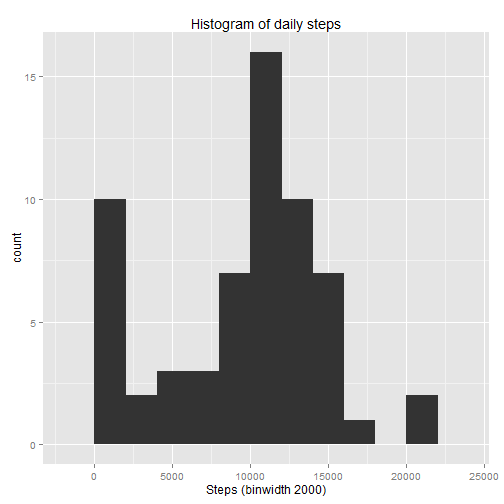
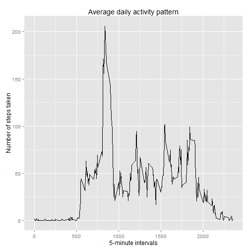
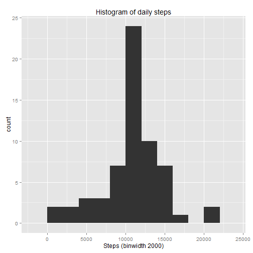
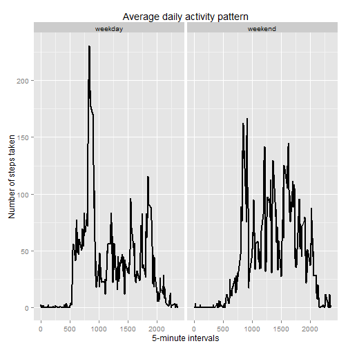

## Loading and preprocessing the data
download.file is currently not supported in knitr
Load the data (i.e. read.csv())

```r
library(dplyr)
library(ggplot2)
```
Process/transform the data (if necessary) into a format suitable for your analysis

```r
dataset <- read.csv("activity.csv", sep = ",",
                    na.strings = "NA", stringsAsFactor = FALSE, header = TRUE)
dataset$date <- as.Date(dataset$date) 
```

## What is mean total number of steps taken per day?

```r
## histogram of the total number of steps taken per day
total_steps_per_day <- aggregate(x = dataset$steps , by = list(dataset$date), FUN = sum ,na.rm=TRUE)
names(total_steps_per_day) <- c("date","steps")
ggplot(total_steps_per_day,aes(x = steps)) +
        labs(x = "Steps (binwidth 2000)", title =  "Histogram of daily steps") +
        geom_histogram(binwidth = 2000)
```

 

Calculate and report the mean and median of the total number of steps taken per day


```r
mean(total_steps_per_day$steps, na.rm = TRUE)
```

```
## [1] 9354.23
```

```r
median(total_steps_per_day$steps, na.rm = TRUE)
```

```
## [1] 10395
```

## What is the average daily activity pattern?

```r
avg_steps_per_interval <- aggregate(x = dataset$steps, by = list(dataset$interval), 
                                    FUN = mean, na.rm = TRUE)
names(avg_steps_per_interval) <- c("interval","avg_steps")

ggplot(avg_steps_per_interval,aes(x = interval, y = avg_steps)) +
        labs(x = "5-minute intervals", title =  "Average daily activity pattern", 
             y = "Number of steps taken") + geom_line()
```

 

Which 5-minute interval, on average across all the days in the dataset, contains the maximum number of steps?


```r
filter(avg_steps_per_interval, avg_steps == max(avg_steps_per_interval$avg_steps))
```

```
##   interval avg_steps
## 1      835  206.1698
```

## Imputing missing values
Calculate and report the total number of missing values in the dataset (i.e. the total number of rows with NAs)


```r
sum(is.na(x = dataset))
```

```
## [1] 2304
```

Devise a strategy for filling in all of the missing values in the dataset. The strategy does not need to be sophisticated. For example, you could use the mean/median for that day, or the mean for that 5-minute interval, etc.
Create a new dataset that is equal to the original dataset but with the missing data filled in.


```r
new_df <- tbl_df(merge(x = dataset, y = avg_steps_per_interval, by = "interval"))
new_df[is.na(new_df$steps),c("steps")] <- new_df[is.na(new_df$steps),c("avg_steps")]
new_df <- select(new_df, steps, date, interval)
```

Make a histogram of the total number of steps taken each day. 


```r
total_steps_wo_na <- aggregate(x = new_df$steps , by = list(new_df$date), FUN = sum ,na.rm=TRUE)
names(total_steps_wo_na) <- c("date","steps")
ggplot(total_steps_wo_na,aes(x = steps)) +
        labs(x = "Steps (binwidth 2000)", title =  "Histogram of daily steps") +
        geom_histogram(binwidth = 2000)
```

 

Calculate and report the mean and median total number of steps taken per day.


```r
mean(total_steps_wo_na$steps, na.rm = TRUE)
```

```
## [1] 10766.19
```

```r
median(total_steps_wo_na$steps, na.rm = TRUE)
```

```
## [1] 10766.19
```

## Are there differences in activity patterns between weekdays and weekends?
Create a new factor variable in the dataset with two levels : 'weekday' and 'weekend' indicating whether a given date is a weekday or weekend day.


```r
new_df <- mutate(new_df, week = weekdays(date)) %>% 
        mutate(wday_type = ifelse(week == "sobota" | week == "niedziela", "weekend", "weekday"))
```

Make a panel plot containing a time series plot (i.e. type = "l") of the 5-minute interval (x-axis) and the average number of steps taken, averaged across all weekday days or weekend days (y-axis). 


```r
avg_steps_per_weekday <- aggregate(x = new_df$steps, by = list(new_df$interval, new_df$wday_type), 
                                    FUN = mean, na.rm = TRUE)
names(avg_steps_per_weekday) <- c("interval","wday_type", "avg_steps")

ggplot(avg_steps_per_weekday,aes(x = interval, y = avg_steps)) +
        labs(x = "5-minute intervals", title =  "Average daily activity pattern", 
             y = "Number of steps taken") + geom_line(size = 1) + facet_grid(.~wday_type)
```

 
